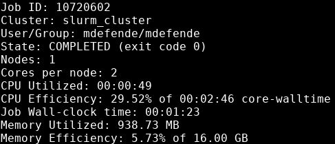

# Job Efficiency

Efficient jobs save you time. Many factors go into queue wait time, but you can control your job requests. Optimizing queue wait times relies on getting resource requests close to actual resource usage. For example, if your task runs as fast with 2 cores as with 4 cores, requesting 4 cores will increase your wait time for no benefit. Other users time will be wasted due to locked up, unused resources. So please read this page to learn how to increase your efficiency and save time.

As with any new skill, developing an intuition for efficiency and resource estimation requires experimentation, practice, and feedback.

Please DO:

- run subsets of your data with varying resource requests to develop intuition
- make use of `seff` to validate
- contact us for advice if you're lost

## Estimating Compute Resources

Being able to estimate the resources a job will need is critical. Requesting substantially more resources than necessary bottlenecks the cluster by preventing jobs from using resources that are reserved, but going unused. Of course requesting too few resources may cause the tasks to perform unacceptably slowly, or to fail altogether.

Questions to ask yourself before requesting resources:

1. Can my scripts take advantage of multiple cores?

    - If yes, then request more cores.
    - If no, then request only one core.
    - Example: RStudio generally runs on a single thread. Any cores beyond the first will go unused and unusable.

2. How large is the data I'm working with?

    - Start by requesting memory equal to double the size of one file, no less than 2 GB per core.
    - If that isn't enough, increase the request by 50% until there are no more memory errors.
    - Example: If your data file is 4 GB, try starting out by requesting 8 GB of memory, then 12 GB, 16 GB, etc.

3. Do my pipelines keep large amounts of data in memory?

    - If yes, you may need to request even more memory than above.
    - Example: Without careful programming, MATLAB code will often make and retain copies of data until finished.

4. How long should my job take?

    - Example: If my laptop is able to run the code on one data file in 2 hours, it will take about that long on Cheaha.
    - Example: Requesting 50 hours of time for a 15 hour process will lengthen the queue time.
    - Don't request too little! Include a buffer to account for scheduler and network issues.

5. How is the software I'm using programmed?

    - Can it use a GPU? Request one.
    - Can it use multiple cores? Request more than one core.
    - Is it single-threaded? Request only one core.
    - Does it use MPI? Request multiple nodes.
    - Be sure to check all of the flags, configuration, and options for the software, or these changes may not work.

6. Which partition is most appropriate?

    - More than 40 GB memory and queue wait times are long? Try `largemem*`.
    - Need a GPU? Use `pascalnodes*`.
    - Software works with AMD? Try `amd-hdr100`.

!!! note

<!-- markdownlint-disable-next-line -->
    Reasonable overestimation of resources is better than underestimation. However, gross overestimation may cause admins to contact you about adjusting resources for future jobs. We are happy to help guide you to an efficient usage of the cluster.

Use `seff` to verify that your code is as efficient as possible.

## Verifying Job Efficiency

It's important to evaluate the efficiency of your job in terms of resource usage after it completes. Remember that Cheaha is a shared resource, so requesting resources that sit unused during a job prevents others from using those resources. As well, because each user has a maximum amount of resources they can use at a given time, having inefficient jobs can increase analysis runtime across many jobs, and increase queue wait times.

In order to look at job efficieny, use the `seff` command.

```bash
seff <jobid>
```

The output will look like:



The job had poor CPU efficiency, requesting 2 CPUs which were only busy for 30% of runtime. Requesting only a single core may have made more sense here. The job also had poor memory efficiency, using less than 1 GB total memory of the requested 16 GB (5.73%). For subsequent jobs using a similar analysis and dataset size, decreasing the requested memory to about 1200 MB and a single CPU would be more efficient, and get the job queued faster.

!!! tip

<!-- markdownlint-disable-next-line -->
    Aim for between 75% and 90% memory efficiency. Lower than that is a waste of resources, but too close to 100% could result in job failure due to an unexpected out-of-memory issue.
