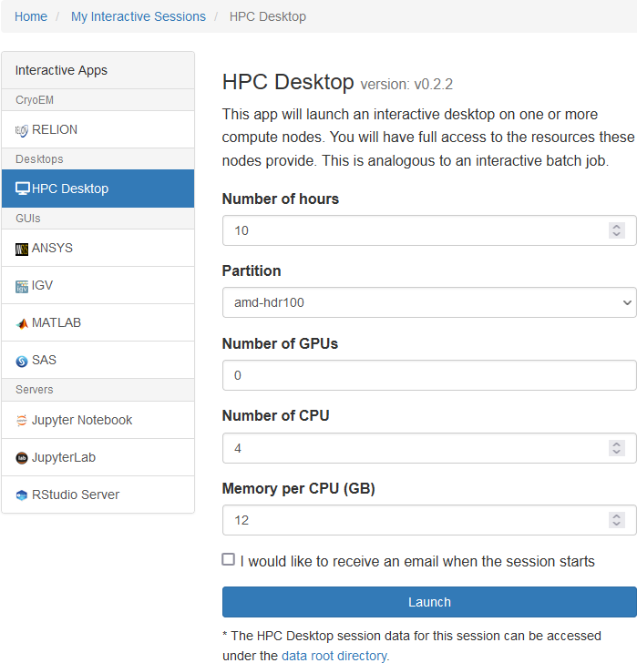
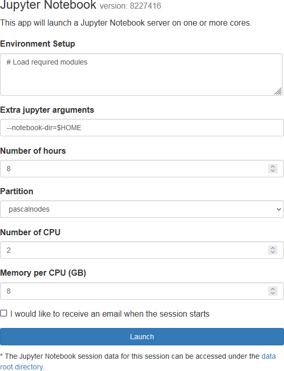
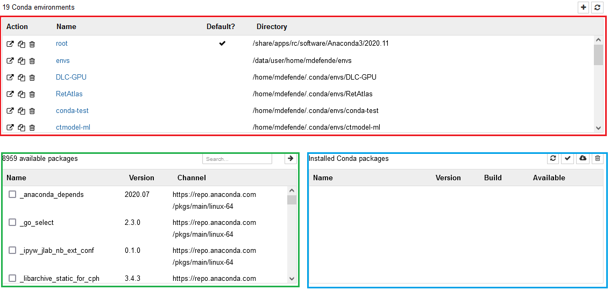

# Interactive Apps

The Interactive Apps dropdown from the toolbar will list a few standalone programs you are able to launch directly from the browser as well as an HPC Desktop that will allow you access all of the other software on Cheaha.

Currently, the available standalone programs are IGV, Matlab, RStudio, SAS, and Jupyter.

All of the interactive apps have similar setup pages. For instance, if we click HPC Desktop, the following screen will appear:



This will allow to choose the number of hours, partition, number of cpus, and memory per cpu needed for the job. These fields are common to all interactive apps and are required. Not all partitions are available when creating an interactive job in OOD. For instance, if you need to use the `largemem` partition, request those resources in a terminal session for an interactive job or submit a batch job.

<!-- markdownlint-disable MD046 -->
!!! tip

    You can decrease wait time in the queue by choosing resources carefully. The closer your request is to actual usage, the more optimal your wait time will be. Please see our section on [Job Efficiency](../job_efficiency.md) for more information.
<!-- markdownlint-enable MD046 -->

Once you've selected the compute resources you need, Launch the job. This will bring you to the My Interactive Sessions page, and read on.

## My Interactive Sessions

The My Interactive Sessions page looks like:


For each job running via Open OnDemand, there will be a card listed on this page. Each card has basic information about the number of cores, nodes, and time remaining for the job. Also shown are the Job ID in the top-left part of the job card, and a Session ID link near the center of the card. The Job ID and Session ID are important for diagnosing issues you may encounter on Cheaha while using Open OnDemand. The Session ID link points to a folder in your home directory with information we may ask for.

Click the `Launch Desktop in new tab` button to open your interactive VNC session. You may have to wait for the card to change from blue to green to launch the job.

<!-- markdownlint-disable MD046 -->
!!! bug

    If your job fails to launch, please see our [FAQ](../../help/faq.md) for possible solutions, or [contact us](../../index.md#contact-us).
<!-- markdownlint-enable MD046 -->

<!-- markdownlint-disable MD046 -->
!!! note

    For HPC Desktop, you do not need to request resources after you open the Desktop. You are already on a compute node. Any tasks you run will use the resources you requested when initializing the job.
<!-- markdownlint-enable MD046 -->

<!-- markdownlint-disable MD046 -->
!!! note

    You can request another interactive session in a terminal in HPC Desktop. Only the terminal you requested the other interactive session in will have access to the new resources. Everything else in the HPC Desktop will run with the resources you requested when creating the initial job.
<!-- markdownlint-enable MD046 -->

These interactive jobs can be stopped early by clicking `Delete` on the right side of the job card.

## Standalone Programs

As shown earlier, some software can be run outside of the VNC session. Setup for most of these follow the same rules as creation of an HPC Desktop job in terms of requesting resources. You will also need to select the version of software to use for the job.

<!-- markdownlint-disable MD046 -->
!!! note

    Versions shown in the OOD form may not line up with versions available in modules. If you need a version not available in OOD, please feel free to [send in a ticket](../../index.md#contact-us).
<!-- markdownlint-enable MD046 -->

### RStudio Server

RStudio is available for use graphically in your browser via OOD. As with other standalone programs, you'll need to select the resources required using the job creation form. You'll also need to select both the version of RStudio you wish to use, and the version of R you wish to use. The job creation form is shown below.


To adjust the environment, please use the Environment Setup box to load modules or Anaconda environments. A common strategy when there is difficulty building R packages is to search for it on [Anaconda](../conda.md), create an Anaconda environment with that package already built, and load the environment in the Environment Setup box. An example is shown below.


<!-- markdownlint-disable MD046 -->
!!! important

    We have recently changed the way we deploy RStudio on OOD. There are now two versions available, and one is marked with the text `(deprecated)`. The version without the deprecation notice is the new deployment method and is preferred for use. It is more flexible and more robust, and will allow us to support you more quickly and easily. The version with the deprecation notice is the previous containerized version. Because it is deprecated, we will not provide additional support for that version. Please move your workflows to the newer version.
<!-- markdownlint-disable MD046 -->

### Jupyter Notebook

Jupyter Notebooks are available for use graphically in your browser via OOD. As with other standalone programs, you'll need to select the resources required using the job creation form. The form is shown below.



To adjust the environment, please use the Environment Setup box to load modules. For GPU applications it is generally necessary to load one of our `cuda##.#/toolkit` modules, and possibly a `cuDNN` module. These are required for `tensorflow`, `keras` and `pytorch`. Use `module spider cuda` and `module spider cudnn` to view the list of appropriate modules. An example is shown below.


<!-- markdownlint-disable MD046 -->
!!! note

    If you get a Failed to Connect message when opening the job, close the tab and wait a couple of minutes. Jupyter is still initializing and takes some time after the job first begins running.
<!-- markdownlint-enable MD046 -->

<!-- markdownlint-disable MD046 -->
!!! tip

    You do not need `module load Anaconda3` in the `Environment Setup` field, it is loaded automatically.
<!-- markdownlint-enable MD046 -->

<!-- markdownlint-disable MD046 -->
!!! warning

    Having `conda activate` statements in the `Environment Setup` field can cause unexpected and silent job failure. Please do not activate conda environments in the Environment Setup field.
<!-- markdownlint-enable MD046 -->

#### Extra Jupyter Arguments

The `Extra Jupyter Arguments` field allows you to pass additional arguments to the Jupyter Server as it is being started. It can be helpful to point the server to the folder containing your notebook. To do this, assuming your notebooks are stored in `/data/user/$USER`, also known as `$USER_DATA`, put `--notebook-dir=$USER_DATA` in this field. You will be able to navigate to the notebook if it is in a subdirectory of `notebook-dir`, but you won't be able to navigate to any other directories. An example is shown below.


#### Submitting the Jupyter Notebook Job

Submitting the job will bring you to the `My Interactive Jobs` window while the Jupyter job is initialized. Click `Connect to Jupyter` to open the Jupyter Home Page.

<!-- markdownlint-disable MD046 -->
!!! note

    If you get a Failed to Connect message when opening the job, close the tab and wait a couple of minutes. Jupyter is still initializing and takes some time after the job first begins running.
<!-- markdownlint-enable MD046 -->

#### The Jupyter Server Home Page

The Jupyter Server Home Page will look like the following


From here, you can navigate to and select an existing notebook, or you can create a new one using one of your existing virtual environments or the base environment. Once inside a Jupyter notebook, you can use the `Kernel --> Change kernel` menu to select your preferred Anaconda environment.

<!-- markdownlint-disable MD046 -->
!!! important

    See [Anaconda Environments](../../workflow_solutions/using_anaconda.md#packages-for-jupyter) for information on Jupyter related packages.
<!-- markdownlint-enable MD046 -->

<!-- markdownlint-disable MD046 -->
!!! warning

    Files deleted within using the Jupyter server interface are not truly deleted. Instead they are moved to `$HOME/.local/share/Trash`. This may cause inflation of personal storage usage on Cheaha.
<!-- markdownlint-enable MD046 -->

#### Python Libraries and Virtual Environments

To run Jupyter with specific libraries and packages outside of the base install, you will need to create a virtual environment first. You can do this either in an HPC Desktop job or in the `Conda` tab of the Jupyter homepage.

The `Conda` has the following layout:



1. Current environments (red): a listing of the current existing environments in your `$HOME/.conda/envs` folder.
2. Available packages (green): a list of all packages available to install from conda sources.
3. Installed packages (blue): a list of the packages installed in the currently selected environment.

To create a new environment, click the `+` button at the top of the `Current environments` pane and enter the name of the environment. After it has been created, you can select packages to install by searching for the package name at the top right of the `Available packages` pane. After selecting the package, click the `->` button, and the package and all its dependencies will be installed.

<!-- markdownlint-disable MD046 -->
!!! note

    If a package is not available using the `conda` command directly, it will not be listed as an available package. Use a terminal window to install the package as necessary.
<!-- markdownlint-enable MD046 -->

<!-- markdownlint-disable MD046 -->
!!! note

    In order to use an environment with Jupyter, the `ipykernel` library is necessary. Creating an environment in the Conda tab will autoinstall this library. If using the terminal, use `conda install ipykernel` to install it.
<!-- markdownlint-enable MD046 -->

After successfully creating your environment, navigate to the Files tab. You can create a new notebook using the `New` dropdown menu in the top right. Select your virtual environment of choice, and a notebook will be created and opened.

### Matlab

Matlab is available for use graphically in your browser via OOD. As with other standalone programs, you'll need to select the resources required using the job creation form. The form is shown below.


<!-- markdownlint-disable MD046 -->
!!! warning

Matlab tends to consume substantial memory at startup. You may experience difficulty with job errors below 20 GB of total memory.
<!-- markdownlint-enable MD046 -->

#### Using Anaconda Python from within Matlab

Matlab has the ability to interoperate with Python from within Matlab. The official documentation for this featuer may be found at <https://www.mathworks.com/help/matlab/call-python-libraries.html>.

This section is dedicated to using this feature with Anaconda on Cheaha. To use Python contained in an Anaconda Environment within Matlab, please use the following steps.

1. Create an [HPC Interactive Desktop Job](#interactive-apps) using [Open OnDemand](ood_main.md).
2. Open a terminal in that job. The following steps should all be run in this terminal unless otherwise specified.
3. [Load the Anaconda Module](../conda.md#loading-anaconda).
4. [Create an Environment](../../workflow_solutions/using_anaconda.md#using-anaconda) in Anaconda with the packages needed.
5. [Activate the Environment](../../workflow_solutions/using_anaconda.md#activate-an-environment),
6. Load the Matlab [Module](../software/modules.md).
7. Start Matlab by entering the command `matlab`.
8. Verify success by entering `pyenv` at the Matlab prompt (not the terminal window). Multiple lines of text will be returned at the prompt. Among them you should see a line like the following, with your environment name in place of `<env_name>`.

    ```text
    Executable: /home/$USER/.conda/envs/<env_name>/bin/python
    ```

You may optionally verify that Python works correctly by entering `py.list(["hello", "world"])`. A python list object should appear in the workspace.
