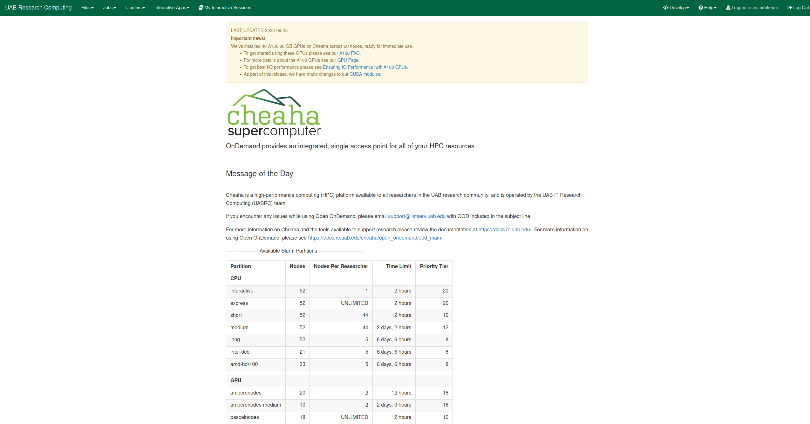

# Navigating Open OnDemand

After creating your Cheaha account, going to [rc.uab.edu](https://rc.uab.edu) will take you to the Open OnDemand (OOD) homepage:

The landing page contains information about current updates to the system, a message of the day with links to our support email and documenation, as well as a helpful [partition table](../getting_started.md#partitions) to help you determine which partition to submit your jobs to. You can access all of the different features of OOD using the navigation tabs at the top of the screen. The most commonly used features are covered below.

## File Browser

You can open a file browser in a new tab by clicking the `Files` dropdown and selecting which default directory you would like to access from `HOME`, `USER_DATA`, or `USER_SCRATCH`.

<!-- markdownlint-disable MD046 -->
!!! note

    `USER_SCRATCH` is shown as both `/scratch` and `/data/scratch`. `/data/scratch` is just a symbolic link to `/scratch`. You can use either, but `/scratch` is preferred since it's an actual folder instead of a symlink.
<!-- markdownlint-enable MD046 -->

You can see the current working directory at the top (green) along with its file and folder list (black). There are also control bars for both working with files (blue) as well as the file browser itself (orange).

### OOD Command Menu

#### Uploading Data

Data can be uploaded from your local machine using this interface. Use the `Upload` button in the OOD Command Menu at the top right to select files from your local browser.

This should be limited to small files only. For large files or datasets, please use [Globus](../../data_management/transfer/globus.md) instead.

#### Opening a Terminal

You can also open a bash terminal in the current directory using the `>_Open in Terminal` command. This should only be used for small tasks since the terminal is running on the login node. For compute-intensive tasks, either request an interactive session in the terminal or request an HPC Desktop session through the Interactive Apps and use the terminal there.

#### Show Dotfiles

Selecting the `Show Dotfiles` option will show the hidden files (those beginning with `.`) in the current folder.

#### Show Owner

Selecting the `Show Owner/Mode` option will show the permissions for the files in the working directory. These permissions (`mode`) can be used to investigate permission issues in shared spaces like `/data/project` directories. The `owner` column shows the Unix ID for the user who owns the file or directory. There is not a known way to change it to the username so its use is limited.
