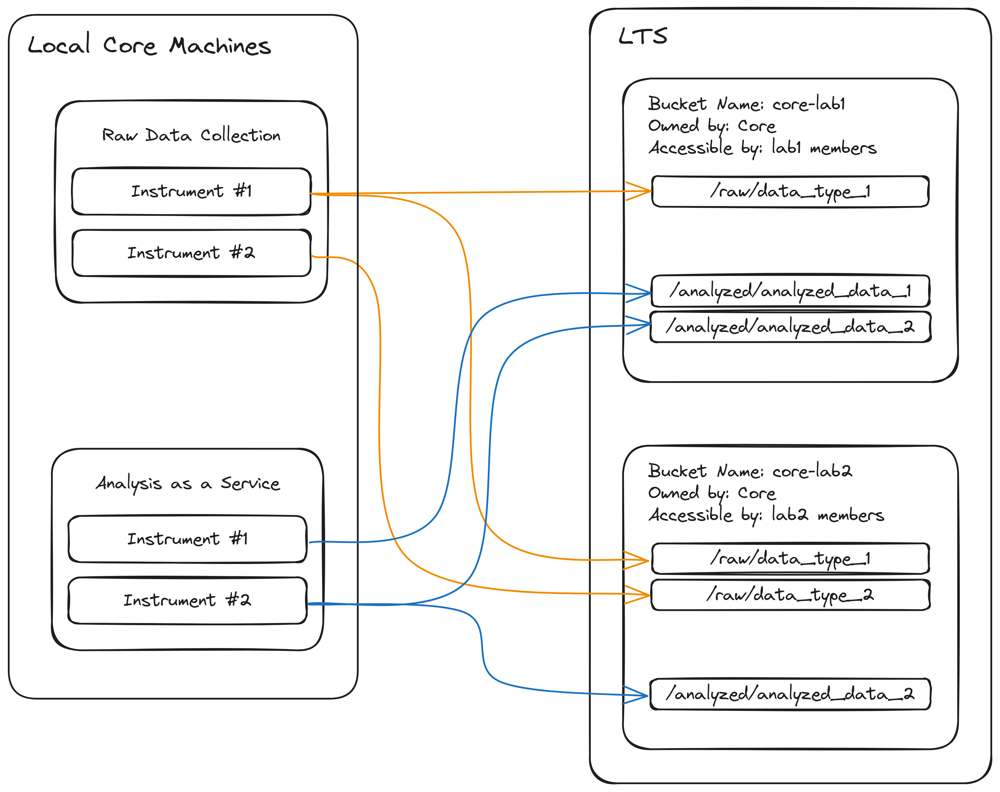

# LTS Core Data Management Plans

[UAB Core Facilities](https://www.uab.edu/cores/ircp/uab-ircp-core-facilities) provide access to research instruments and services for scientific and clinical investigators. Cores can generate large amounts of data very quickly for many labs and so have some unique data management concerns. These concerns can be summarized as follows:

1. Data transfer off local machines
2. Data organization
3. Data distribution

UAB Cores can request a 75 TB allocation on LTS with possibilities for expansion to use for both storage and distribution of data. Together with Globus and CLI tools for transfer, LTS can be the basis for a full core data management plan. This documentation aims to provide details of general solutions for common problems with managing large amounts of data in a core.

## Specifics of Core LTS Accounts

Core LTS accounts behave the same as lab LTS accounts. The base allocation is 75 TB across 100 buckets with possibilities for expansion over time based on the needs of the core. The account will be a separate entity that owns its own buckets and data. Either the director data manager of the core will own the credentials for the core account and so will receive a set of access and secret keys separate from their personal and lab keys.

<!-- markdownlint-disable MD046 -->
!!! warning

    Do not share these keys with anyone. A person with core LTS keys have essentially admin access on all data stored in core buckets. This allows them to change who can access data as well as delete any and all data in the core LTS account.
<!-- markdownlint-enable MD046 -->

## Data Organization

Effectively organizing an LTS space will dictate where data are transferred within it. The suggested storage structure can be summarized as follows:

1. The core creates a bucket for each lab or group it services containing raw or analyzed data for that group. Permissions for each bucket are managed independently.
      1. Due to all buckets in LTS needing to have unique names, buckets should be named more descriptively than just the name of the group to which the data belong. Instead, the format `[core_name]-[group_name]` will be both specific and unique enough to work in most circumstances. For example, data analyzed by the Research MRI Core (RMRIC) core for group `smithlab` would be put in a bucket named `rmric-smithlab`. Keep in mind the [allowed characters](lts_faq.md#what-are-valid-bucket-names-in-lts) when creating bucket names.
2. Within each bucket, data are generally organized by classification as raw or analyzed and then further organized by type of data or analysis. The exact form this takes is left up to the core itself. This style of organization lends itself to both structural clarity and automation of data transfer.

A simplified diagram illustrating this organization can be seen below.

Due to data sensitivity, we advise against storing data from different groups in the same bucket. Managing permissions for a bucket where many groups can only access specific portions of a bucket is cumbersome and prone to error. Instead, separate policy files should be kept for each bucket specifying which researchers from each lab or group should be able to access the stored data. These policy files can be kept in a single location owned by the core for future modification. This also facilitates future transfer of bucket ownership from the core to the lab or group to whom the data belongs after data collection or analysis is complete.

## Transfering From Local Machines to LTS

The details concerning data transfer from core instruments and analysis machines can differ drastically across cores. For cores where all data are transferred from a single machine or server to LTS, a single installation of Globus Connect Personal or [Globus Connect Server](https://www.globus.org/globus-connect-server) would be satisfactory for uploading data to LTS.

For situations where data either needs to be transferred multiple machines to LTS. please contact [Research Computing](../../index.md#how-to-contact-us) for a consultation.
