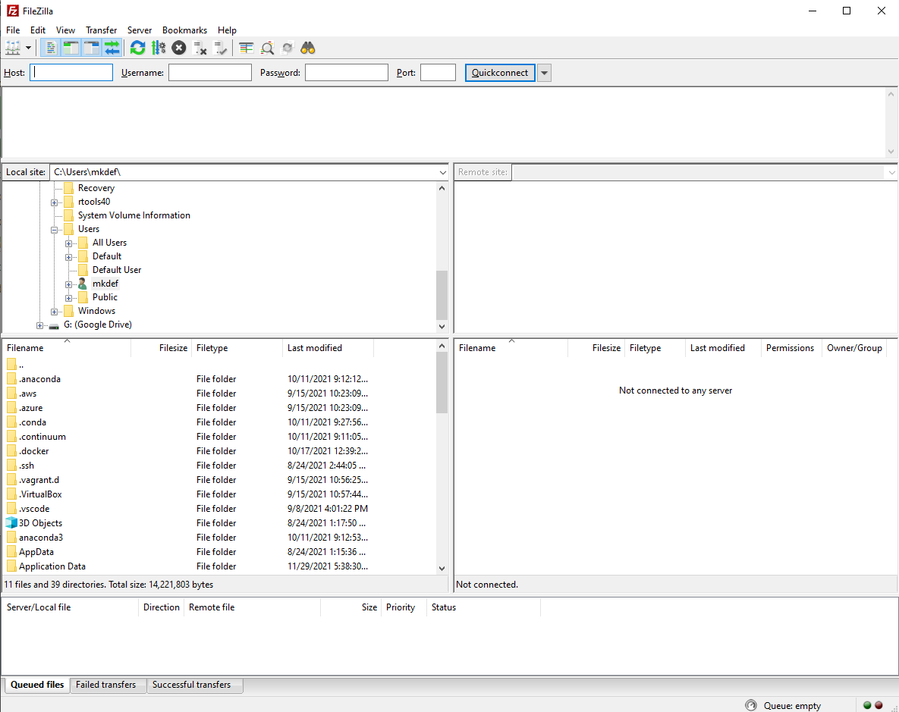
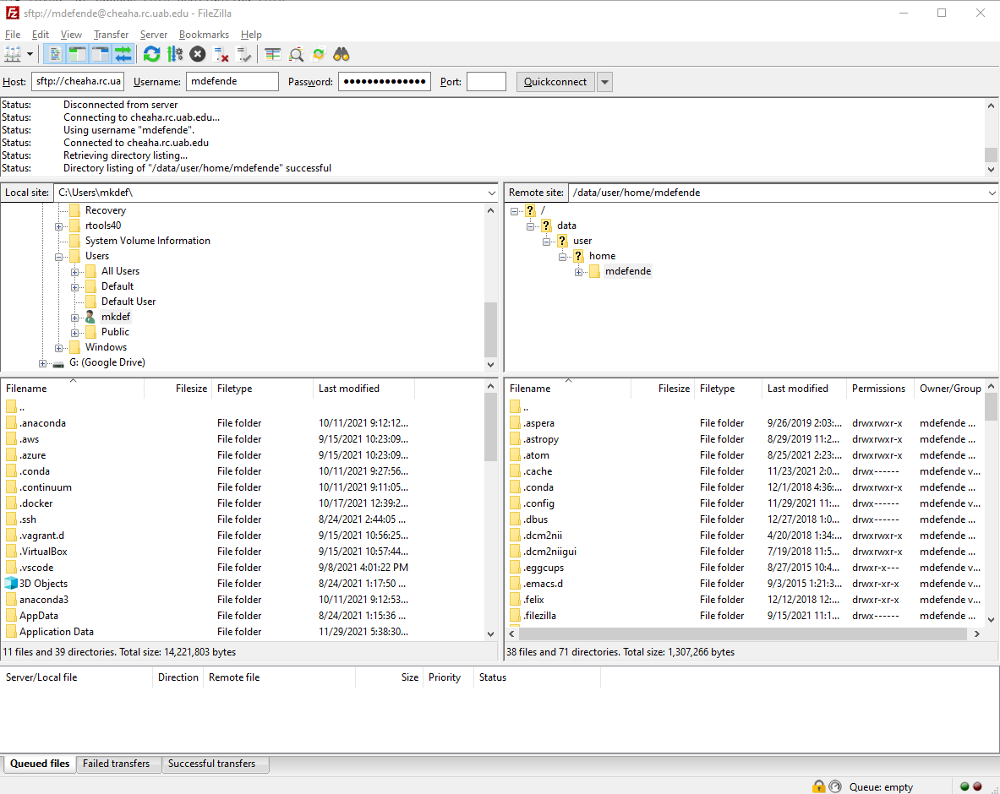

# FileZilla

Filezilla is a free SFTP platform used to transfer data between a local machine and a remote server, in this case remote storage accessible to Cheaha and UAB Cloud or long-term S3 storage. Filezilla is useful for medium sized data transfers from a local machine as opposed to Globus which can easily connect two different local or remote servers and handle large quantities of data.

## Installation

To download the program, go to [the FileZilla site](https://filezilla-project.org/) and click Download FileZilla Client. Filezilla is also already installed on Cheaha and can be accessed through the Accessories menu.

## Using FileZilla

Once FileZilla is installed and you open it, you will see the following window

A file browser for the local machine FileZilla is running on is on the left while the file system for the remote site will be shown on the right once a remote site has been connected.

### Creating a Remote Connection

You can easily connect to a remote site using the QuickConnect bar near the top of the window. You will need to input the following options:

- Host: `sftp://cheaha.rc.uab.edu`
- Username: your BlazerID or XIAS ID (do NOT include '@uab.edu')
- Password: your BlazerID or XIAS password
- Port: `22`

Click `Quickconnect` and you will be connected to the remote storage system. The window should now look like:

When connecting in the future, you will be able to select the connection from the dropdown arrow next to the Quickconnect button.

In both the local and remote panes, you can navigate to the directories you are transferring from and to. You only have access to directories you can normally access on Cheaha, so your user space as well as any project directories you have been added to.

### Transferring Data

From here you can drag and drop whichever files and directories between the local and remote site windows. This will automatically initiate a file transfer. The directory structure is maintained from the source to the destination and is recursive, so all subdirectories and folders within the main directory will be transferred as well.

Transfer status will be logged at the bottom of the window. Once all your files have been transferred, you can close FileZilla which will close the SFTP connection.
