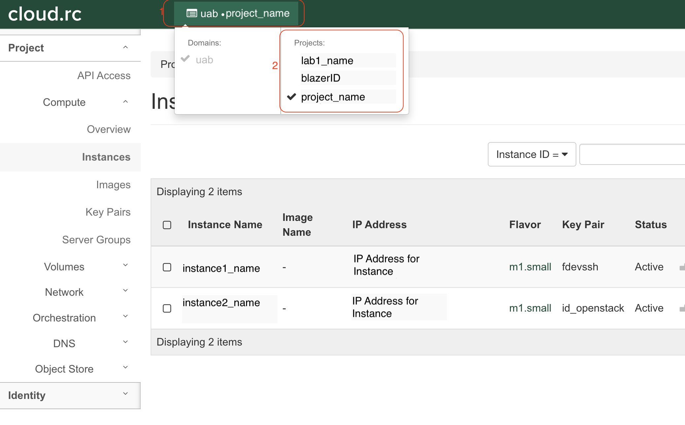
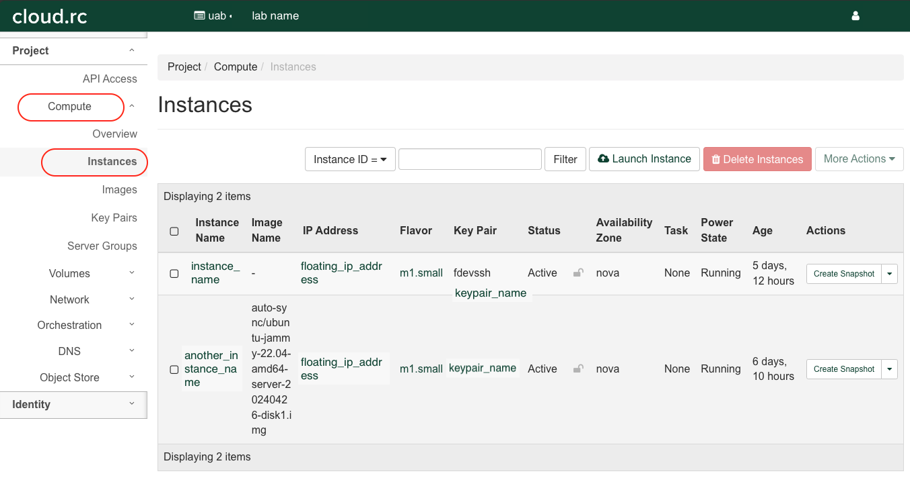
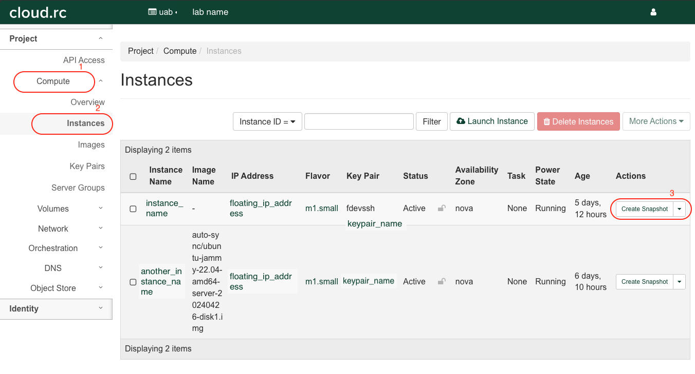

# UAB Cloud Project Space

UAB's cloud infrastructure is based on [OpenStack](https://www.openstack.org/) cloud software, our cloud.rc platform supports project spaces that provide a platform for collaboration on research projects using allocated resources from enforced quotas. By default, a Cloud RC user gets their own project space with a standard quota, named after their blazer ID, where they can create and deploy instances effectively for use. Labs can also request their own project spaces, with this project space serving as a platform for members of your Lab to create and use instances collaboratively. For example, Virtual Machines (VMs) can be created from instances that package the research needs of your lab. These instances can be configured to include specialized research software designed to perform optimally using particular Operating Systems (OS) that align perfectly with a lab's requirements. The resources the cloud project space would provide opportunities for effective collaboration that improve your research outcomes.

## Why do I Need a Project Space

As stated prior, the dedicated project spaces available on UAB cloud.rc offer research Labs a number of solutions for managing their various and intensive computational needs. These project spaces will provide a secure and collaborative environment where members of your Lab can access, share, and manage resources efficiently. By using this resource, your Lab can ensure that their research projects have the necessary computational power and flexibility to advance scientific inquiry, facilitate collaboration, and optimize resource utilization. Your Lab would benefit from having a project space on UAB cloud.rc for the following reasons.

1. Improved collaborations between members of your lab, as they all have access to the same resources and data to facilitate research.
1. Specific environments can be created from instances that support highly specialized research tools only available on particular OS, and hardware. These specific environments also can be highly optimized to significantly improve compute times for your research.
1. Use of this resource can also help your Lab save on a number of operations costs, particularly around the procurement and maintenance of resources.
1. Your Lab can scale their project resources down or up dependent on research needs with ease and without significant delays, this way you avoid incurring additional costs for purchasing new hardware or under utilize already purchased resources.
1. Created instances in your project spaces also provide security and privacy that can help to further protect your research data.

The benefits of creating and using a project space for your Lab are almost endless, all geared towards improving your collaboration in producing high quality research.

## How do I Switch Project Spaces?

As a UAB cloud.rc user, you can easily switch between your personal project space and other Lab project spaces you are a part of. From the dashboard of the homepage after login, navigate to the `Domain` and `Projects` drop down button, located in the top pane (upper left quadrant of the page) as shown in the image below. You can then select from the list of project spaces you belong to. The project space in your `blazerID` is your personal project space, other project spaces listed are the project spaces for Labs or Projects you are a part of.



## How Would I Create a Project Space for My Research Lab

To enjoy the resources available on UAB Cloud, you would have to send in a request to the UAB IT Research Computing Team via email [support@listserv.uab.edu](mailto:support@listserv.uab.edu). In the email, please state clearly your needs and the resources you would require for your lab. Your request should also include members of your lab to be included in the project space, and a preferred name (usually same as lab project folder on Cheaha). Instances created within this project space can be accessed by other members of your lab.

## Creating an Instance in a Shared Project Space

The steps for creating an instance in a project are the same as creating an instance in your personal project space, you can find a detailed guide here in our [Cloud Tutorial](tutorial/index.md). You would however, need to contact us to create a project space for your lab, as well as users who would be members of the shared project space.

All members of a project space can access all instances within the shared project space on UAB Cloud RC. They can do this by navigating through the landing page that doubles as the dashboard, the image below highlights the exact section.


When in the project space, select `Compute` and then `Instances` to see available instances in your project space.

<!-- markdownlint-disable MD046 -->
!!! note

    Please note, all members of your project space, can create, and delete instances. In essence, all members of the project space, have the same user privileges.
<!-- markdownlint-enable MD046 -->

## Sharing an Instance in a Project Space

There are a couple of ways to collaborate while using on an instance, this article would focus on some easy-to-use ways to use an instance in a shared project space.

### Creating an Image From an Instance Using Snapshots

Snapshots in OpenStack are used like Images, thereby making it relatively easy to create Images from an Instance. To create an Image that can then be shared with other members of your project space, so they can replicate your Instance, please follow the below steps;

1. Go to the `Compute` pane and then navigate to the `Instances` tab in your project space dashboard. You will then see a list of available instances.



1. Select the Instance you want to create an Image for. Under the Actions, click on `Create Snapshot`.



1. Insert a name for the Snapshot, and then click `Create Snapshot`.


1. You will be redirected to the `Images` page, where you newly created Image will appear amongst a list of other available images.


The created Image can then be launched, following the same instructions for creating an [Instance](../uab_cloud/tutorial/instances.md). This method would be most ideal if you want to recreate an environment for performing an analysis, but would prefer the workflow be run on different VMs, or to separate datasets or create some form of access restriction on particular research.

### Creating an Image From a Volume

There are detailed instructions here on how to create an image from a Volume, [here](snapshots.md#creating-a-volume-snapshot).

### Using a Key Pair to SSH

Another way to access a created instance would be to create a public key and private key for your local machine, and then share this public key with the creator of the instance. As creator of the instance you would need to add individual public keys of persons who you would want to access the created VM into the `authorized_keys` file. You can edit this file by using the command below, add the shared public key in a new line inside the file (copy and paste). Save the file and follow instructions here for remote accessing your instance using [`SSH`](remote_access.md).

```bash
# access and edit the file using

nano cd ~/.ssh/authorized_keys

```
