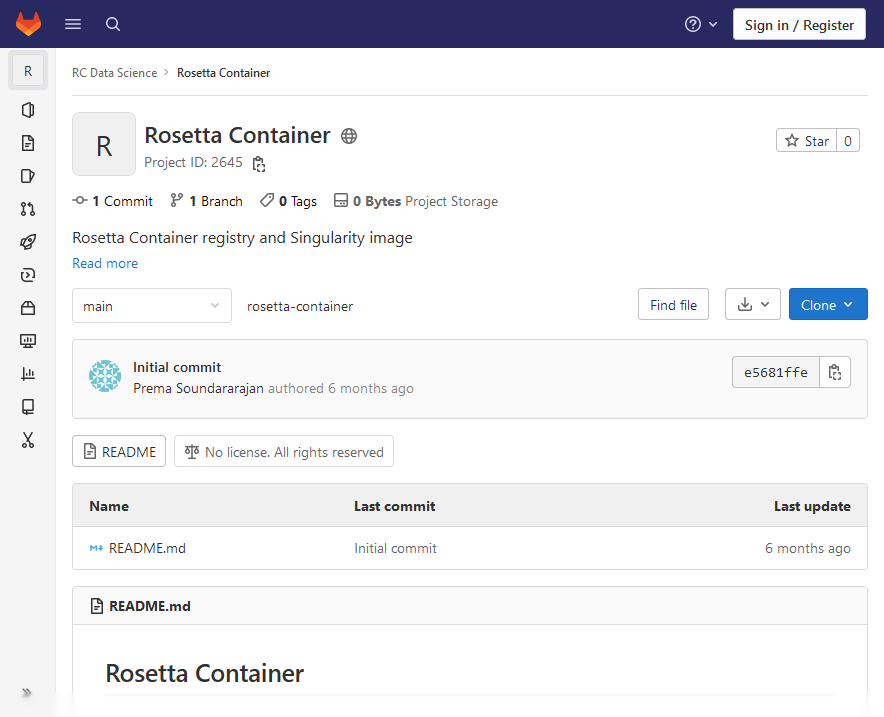

# How to Collaborate with Git

[Git](git.md) is a powerful tool for version control of software and other plain-text information. However, Git alone is not ideal for enabling and facilitating collaboration between many users working on the same research software project. Be sure to check the [Important Note on Terms](#important-note-on-terms) if you aren't familiar with Git.

If you are here because you need to know how to get software from either instance, please see [Obtaining Software](#for-obtaining-software) below.

If you are here because you need a place to collaborate with others on a software project, please see [Hosting Software](#for-hosting-software) below.

## Important Note on Terms

On most pages in this documentation, we use "local" to refer to your laptop or desktop computer, and "remote" to refer to [Cheaha](../cheaha/getting_started.md) or a [Cloud.rc](../uab_cloud/index.md) virtual machine.

When dealing with Git and repository hosting services like GitHub and GitLab we use remote to refer to repositories that are on a repository hosting site like GitHub or GitLab, and local to refer to repositories that are not on a repository hosting site.

To summarize:

- Git, GitHub, GitLab context
    - `local` - the repository on a computer where you work on your code (laptop, desktop, Cheaha)
    - `remote` - a remote server or service that stores code (github, gitlab, etc)
- Cheaha and Cloud.rc context
    - `local` - the machine (laptop, desktop) you use to access Cheaha or the Cloud.rc VM
    - `remote` - Cheaha or the Cloud.rc VM

## For Obtaining Software

### Cloning from GitHub

To do anything with GitHub, you will first need to navigate to their website <https://github.com> and [create an account](https://docs.github.com/en/get-started/signing-up-for-github/signing-up-for-a-new-github-account).

To clone a repository, be sure you have the repository URL. Then, using `git` at a terminal, [clone](git.md#cloning) the repository using whatever settings are appropriate. GitHub repository pages look something like the page for this documentation, shown below.

You may also use the "Code" button on the page to see instructions for cloning the repository.

More in-depth instructions, including for SSH cloning, are provided at the [official documentation](https://docs.github.com/en/repositories/creating-and-managing-repositories/cloning-a-repository).

### Cloning from GitLab

To do anything with our GitLab instance, you will first need to create an account. Please see our [GitLab Account Management page](../account_management/gitlab_account.md).

To clone a repository, be sure you have the repository URL. Then, using `git` at a terminal, [clone](git.md#cloning) the repository using whatever settings are appropriate. Be sure to append `.git` to the end of the repository or the clone will note be successful. For example, if the URL is `https://gitlab.rc.uab.edu/user/repository` then you will clone `https://gitlab.rc.uab.edu/user/repository.git`. GitLab repository pages look like the example shown below.

You may also use the "Clone" button on the page to see instructions for cloning the repository.

More in-depth instructions, including for SSH cloning, are provided at the [official documentation](https://docs.gitlab.com/ee/gitlab-basics/start-using-git.html#clone-a-repository).

## For Hosting Software

### Which Do I Choose?

- Want to collaborate publicly and outside UAB? Consider using [GitHub](#github-hosting).
- Want your project private or internal to UAB? Consider using our [GitLab](#gitlab-hosting) instance.

It is also possible to collaborate publicly using GitLab, and privately with GitHub, but there may be additional challenges.

### GitHub Hosting

To do anything with GitHub, you will first need to navigate to their website <https://github.com> and [create an account](https://docs.github.com/en/get-started/signing-up-for-github/signing-up-for-a-new-github-account).

The official GitHub documentation is available at <https://docs.github.com/>.

#### New Repositories with GitHub

To create a new project on GitHub, please see the [official documentation](https://docs.github.com/en/get-started/quickstart/create-a-repo?tool=webui). Once you have created the repository and have its URL, [clone](#cloning-from-github) it to begin working on it locally.

#### Uploading Code to GitHub

To upload existing code from a local repository to GitHub, first [Create a New Repository](#new-repositories-with-github) which will host the existing code. Then follow the instructions in [Uploading an Existing Code Folder](#uploading-an-existing-code-folder).

### GitLab Hosting

To do anything with our GitLab instance, you will first need to create an account. Please see our [GitLab Account Management page](../account_management/gitlab_account.md).

The official GitLab documentation is available at <https://docs.gitlab.com/>.

#### New Repositories with GitLab

To create a new repository on GitLab, please see the [official documentation](ttps://docs.gitlab.com/ee/user/project/repository/#create-a-repository). Once you have created the repository and have its URL, [clone](#cloning-from-gitlab) it to begin working on it locally.

#### Uploading Code to GitLab

To upload existing code from a local repository to GitLab, first [Create a New Repository](#new-repositories-with-gitlab) which will host the existing code. Then follow the instructions in [Uploading an Existing Code Folder](#uploading-an-existing-code-folder).

## Common Scenarios

### Uploading an Existing Code Folder

The process for this has a few intricate steps that may be unfamiliar even to regular users of git, and has a few pitfalls.

1. Use `git init` in the top-level code folder on the local machine, if it is not already a git repository. If it already is a repository, be sure the primary branch is called `main`. Use `git branch -m <oldname> main`.
2. Create a repository on the remote server ([GitHub](#new-repositories-with-github), [GitLab](#new-repositories-with-gitlab))
3. Use `git remote add origin <url>` to add the remote URL to the local repository with the name `origin`.
4. Verify the URL is correct with `git remote -v`. Fix it with `git remote set-url origin <url>` if needed.
5. Checkout the main branch without `git checkout main`.
6. Use `git pull origin main --allow-unrelated-histories` to combine the main branches of the remote and local repository, within your local repository.
7. Use `git push origin main` to push the combined histories to the remote repository.
8. Be sure to verify the repository looks good at the GitHub/GitLab repository page (depending on which you used).

<!-- markdownlint-disable MD046 -->
!!! note

    `--allow-unrelated-histories` is necessary because Git considers the remote repository to be a completely distinct entity from the local repository. Their histories are unrelated.
<!-- markdownlint-enable MD046 -->
