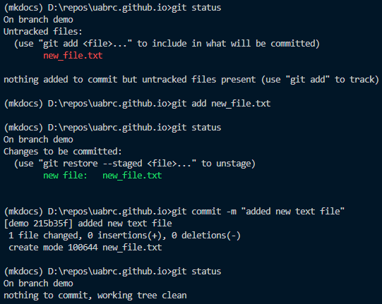
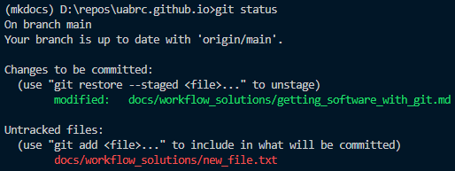

# Git

<!-- markdownlint-disable MD046 -->
!!! construction

    This page is a stub and is under construction.
<!-- markdownlint-enable MD046 -->

## Introductory Guides

### Educational Resources

The internet has many guides for using git. Rather than devise our own complete lesson plan for using git, we recommend finding and using one of the high-quality lessons available on the internet. The Software Carpentries group offers a number of high-quality online lesson plans for introductory computing and data science tools. While these lesson plans are intended to be delivered by an instructor in a classroom setting, they can be still be useful to follow solo. For the git lesson, see <https://swcarpentry.github.io/git-novice/>.

Denser and more complete documentation is available at <https://git-scm.com/doc>.

## Reference

### Glossary

- The **working tree** is git's internal representation of the collection of files and directories in the repository directory.
- The **index** is the collection of changes since the most recent commit that have yet to be committed.
- The **staging area** is the set of changes selected by the user to be committed next.
- A **repository** is a working tree together with all of the commits applied to that repository. Repositories also house one or more branches, a configuration file, an index, and any number of remote repositories. Git is decentralized, meaning all repositories are independent, though it is possibly to synchronize them.
    - A **local repository** is a repository that is housed on the same machine you are working on.
    - A **remote repository** or **remote** is a repository that is housed on a machine other than the one you are working on. Remotes are often housed on internet repository services like <https://github.com> and <https://gitlab.org>. UAB also maintains a private Gitlab instance at <https://gitlab.rc.uab.edu>.
- A **branch** is a single thread of commits made to the working tree. Branches are independent of each other until they are merged.
- A **commit** is a collection of changes that have been made to the working tree. Commits have associated messages. Repositories and branches are structured collections of commits.
- **Merging** is the process of incorporating changes from a source branch into a target branch.
- **Pushing** means communicating changes out to a remote repository.
- **Fetching** means retrieving changes in from a remote repository.
- **Pulling** is fetching followed by merging.

### How should I configure git?

Good practices for configuring git include adding your name and email globally, so that you received proper attribution when making changes to repositories.

To add your name and email enter the following two lines, replacing `<name>` and `<email>` as appropriate.

```bash
git config --global user.name <name>
git config --global user.email <email>
```

Less common, but helpful, use cases are available here <https://git-scm.com/book/en/v2/Customizing-Git-Git-Configuration>.

Full documentation is available here <https://git-scm.com/docs/git-config>.

### How do I stage and commit files?

Staging files is done with the `git add` command, committing files with `git commit`.

```bash
git add new_file.txt
git commit -m "added new text file"
```



[Full documentation of `git add`](https://git-scm.com/docs/git-add)

[Full documentation of `git commit`](https://git-scm.com/docs/git-commit)

### How do I check the status of changes?

Use `git status`. It will show your current branch, staged files and unstaged files.



[Full documentation of `git status`](https://git-scm.com/docs/git-status)

### How do I stop tracking a file?

Use `git rm <file>` if the file has no changes. Despite the name this will not delete the file, only stop git from tracking any future changes. Specifically, it will stage a removal of the file from git tracking, which you will need to commit to stop tracking that file.

If the file has changes:

- Use `git rm --cached <file>` to keep the changes
- Use `git rm -f <file>` to remove the changes


[Full documentation of `git rm`](https://git-scm.com/docs/git-rm)

### How do I reset changes before committing?

<!-- markdownlint-disable MD046 -->
!!! danger

    `git reset` can be highly destructive if used improperly. If you are unsure then please do not use `git reset --hard`.
<!-- markdownlint-enable MD046 -->

Use `git reset <mode> <commit>`. There are several modes:

- `--hard` is destructive
    - changes since `<commit>` in the working tree and index are discarded
    - all untracked files "in the way" of those changes are deleted
- `--mixed` (default) is non-destructive
    - changes since `<commit>` in the index are tracked but not staged
- `--soft` is non-destructive
    - changes since `<commit>` in the index are staged

If `<commit>` is left empty then the most recent commit on the working branch is used. If you wish to specify a commit, then provide enough characters at the start of the commit hash (7 characters is usually enough for unique identification).

<!-- markdownlint-disable MD046 -->
!!! danger

    Using `git reset --hard` is destructive. All changes since the last commit are discarded and are most likely lost.

    Use `git reset --mixed` (default) or `git reset --soft` instead.
<!-- markdownlint-enable MD046 -->

### Help! Something went wrong

Stop. Breathe. Don't panic. It's likely that your changes are still cached by git. Don't make any additional changes or run any git commits as this may cause cached files to be deleted. If you have some experience with git, then chances are good you can recover your lost changes. If you do not have much experience with git or do not feel confident recovering, then please contact [Support](../help/support.md).

If you wish to proceed without assistance, then please visit the following two pages depending on your situation.

#### I need to undo a change that I've made

<!-- markdownlint-disable MD046 -->
!!! warning

    Do not use `git reset --hard` if you are not sure of what you are doing!
<!-- markdownlint-enable MD046 -->

Please visit: <https://wwarriner.github.io/gitfix/>, read each card carefully, and answer the questions until you arrive at a solution. Do not use `git reset --hard` unless you are sure of what that command will do.

#### I used `git reset --hard` and/or lost changes

The changes may be lost permanently, or they may be partially recoverable. Git has a garbage collector for old versions of files that is emptied periodically as new commands are run. If you have not run any commands since losing changes, the old versions should still be available.

To recover the changes:

- In a terminal, navigate to the repository directory.
- Use the command `git fsck --lost-found`.
- Navigate to the subdirectory `.git/lost-found/other`.
- **Highly recommended**: make a backup of the `.git/lost-found/other` folder before proceeding.

The recovery will only be partial. File content should all be recoverable. However, directory structure and file names will be lost. This solution will require considerable manual or scripted work to restore directory structure and file names.
