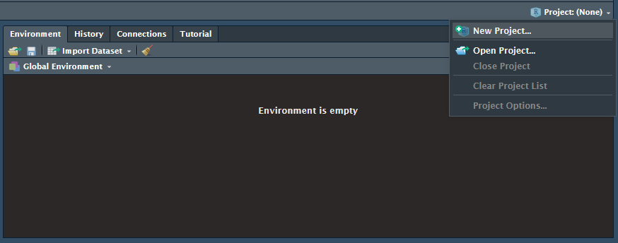
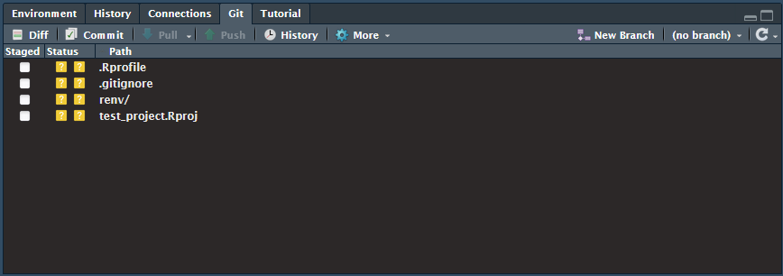
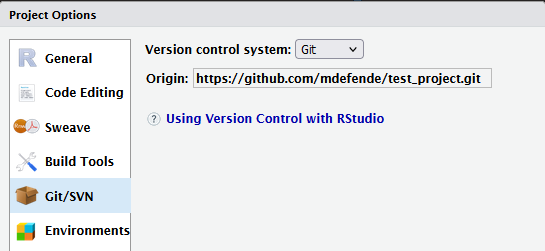

# R Projects and Environments

When working on multiple projects, it's likely that different sets of external analysis packages and their dependencies will be needed for each project. Managing these different projects is simple in something like [Anaconda](using_anaconda.md) by creating a different virtual environment for each project, but this functionality is not fully built into RStudio by default.

Instead, we suggest to take advantage of [R Projects](https://support.rstudio.com/hc/en-us/articles/200526207-Using-RStudio-Projects) and the [renv](https://rstudio.github.io/renv/articles/renv.html) package to keep environments separate for each project you start.

## R Projects

RStudio and Hadley Wickham have [written extensively](https://r4ds.had.co.nz/workflow-projects.html) on using Projects to organize different research projects, so please read through that documentation. These docs will give a condensed overview of how to set up Projects.

### Creating a Project

To begin, projects start at a parent or root directory within which most, if not all, files associated with that project should be stored. To create a project, find the Project dropdown at the top-right of RStudio, above the Environment window.

This will bring up a window allowing you to create a Project in a new directory or an existing one. Once you choose where the project should be stored, RStudio will reset, change the working directory to the project root, and create a .RProj file that controls the project settings. The project dropdown will also have the project name now.

### Project Settings

At this point, you can start writting scripts as normal, but it would be useful to change some of the settings for the projects to help with some RStudio performance and set up Git and renv.

#### General Settings

Click the project dropdown again and select Project Options at the bottom. A window will appear with general settings. We advise to change the general settings to the following:

This will create a clean environment each time you open the project and does not save environment variables when exiting RStudio. In our experience, trying to automatically load variables from a previous session can cause RStudio to open very slowly or crash depending on the amount of data being used. All variables can be recreated by running your scripts or by purposefully saving and loading selected variables from other data files such as csv or RData.

#### Git Settings

Another useful part of Projects is Git integration. Normally, you would need to manage git using the command line even though your development is in RStudio, but with Projects you can link a remote git repository to your Project. It then provides a graphical interface for creating branches, committing changes, and generally managing a remote code repository.

<!-- markdownlint-disable MD046 -->
!!! note

    To read more about how to get started with Git, please read our [git documentation](getting_software_with_git.md)
<!-- markdownlint-enable MD046 -->

1. To begin, you should create an empty repository either at [Github](https://github.com/) or [UAB's Gitlab](https://gitlab.rc.uab.edu/users/sign_in) where your project will be stored. this will open a new page with instructions on linking this remote repository with your local project. Keep these instructions open for later. A picture of the important piece can be seen below.

    

2. Then open the Git/SVN tab in the Project Settings. It will have no option set:

    

3. Click the Version Control dropdown menu and select Git. RStudio will ask you if you want to initialize a new git repository. Click Yes. Restart RStudio if it asks you to. Now a new Git tab will be available in the upper right pane

    

4. You will then need to add a link to the remote repository as the origin.
    1. Click the More dropdown in the Files tab in the bottom right pane and select Open New Terminal Here

        

    2. Copy the instructions for pushing an existing repository from the Git repo into your terminal. You can see an example of these instructions under step 1, and commands specific to your repository were given after you created your repository. Run these commands to link the local Project to the remote repository. Afterwards, the Origin field in the Git/SVN options will have changed to your remote repository address.

        

